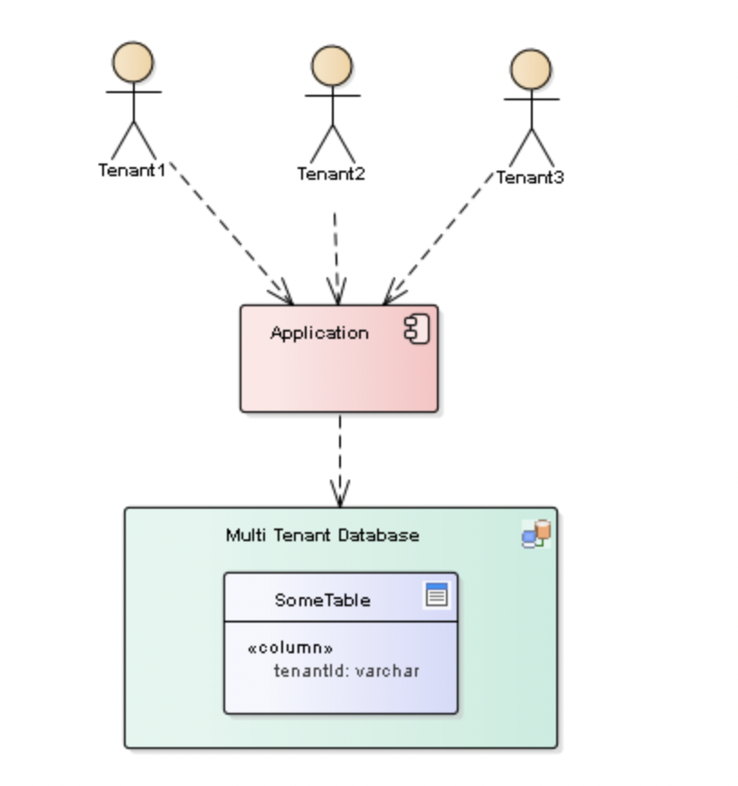

# Multitenancy

A Multitenant Application is a shared resource that allows separate users, or "tenants," to view the application as
though it was their own. A typical scenario that lends itself to a multitenant application is one in which all users of
the application may wish to customize the user experience but otherwise have the same basic business requirements.

## There are several models to achieve multitenancy in an application:

1. `Database per Tenant`: Each Tenant has its own database and is isolated from other tenants.
2. `Shared database, Separate Schema`: All Tenants share a database, but have their own database schemas and their own
   tables.
3. `Shared Database, Shared Schema`: All Tenants share a database and tables. Every table has a Column with the Tenant
   Identifier, that shows the owner of the row.

Or think about it like this:

1. `Database per Tenant`: Every Tenant has its own house.
2. `Shared Database, Separate Schema`: Every Tenant in the same building, but has its own apartment.
3. `Shared Database, Shared Schema`: Everyone is living in the same apartment and all stuff is marked with sticky-notes
   to show who owns it.

### Multitenant Example - Spring Data JPA configurations

## Implementing the Shared Database with Discriminator Column pattern using Hibernate Filters

Both Spring and Hibernate support multitenancy.

1. On the Spring side, we will have one class to implement that intercepts the request and, on its basis, sets the
   appropriate tenant in the context (`TenantContext`).
2. Implement the interface `org.springframework.web.servlet.AsyncHandlerInterceptor`. We have to override
   the `preHandle()` and `postHandle()` methods in order to intercept the request and then clear the `TenantContext`.

### Some errors encountered:

- Configuration of `transactionManager` ignored without the application.yml config:
  `jpa:
    open-in-view: false`
  -> **false**: it needs `@Transactional`
  -> **true**: no need for `@Transactional`
- `@Aspect` not working without `@Transactional` on service method;
- The `entityManager` is intercepted during a transaction, when a session is opened;

### References

https://www.bytefish.de/blog/spring_boot_multitenancy.html

https://callistaenterprise.se/blogg/teknik/2020/10/17/multi-tenancy-with-spring-boot-part5/